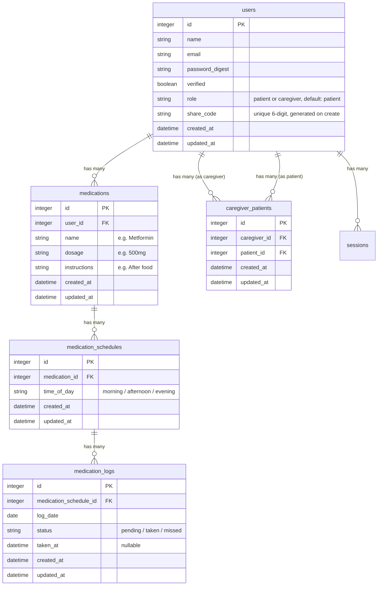

# feat: PillPal - Medication Reminder & Caregiver Dashboard

## Overview

A medication reminder app that helps elderly Malaysians take their medicines on time, with a caregiver dashboard so family members can monitor compliance. Built for Krackathon Q1 2026 (Prompt 01: Solve One Real Malaysian Problem - Healthcare domain).

## Problem Statement

Millions of elderly Malaysians manage multiple medications daily from government clinics (KKM). Medicine comes in plastic bags with hard-to-read labels. Complex schedules ("before food", "after food", "at night") lead to missed doses, double-dosing, or stopping medication entirely. Adult children working in other cities can't check if their parents in kampung are taking their meds.

## Proposed Solution

PillPal provides:
1. **Simple medication dashboard** - Today's medications with large "Mark as Taken" buttons
2. **Caregiver linking** - Family members connect via 6-digit share code to monitor compliance
3. **Medicine label scanning** - AI-powered camera scan to auto-fill medication details (moonshot feature)

## Data Model



## Acceptance Criteria

### Functional Requirements

- [ ] User can sign up and choose role (patient or caregiver)
- [ ] Patient can add medications with name, dosage, instructions, and schedule times (morning/afternoon/evening)
- [ ] Patient dashboard shows today's medications grouped by time of day
- [ ] Patient can tap "Mark as Taken" and see immediate visual feedback
- [ ] Patient can undo "Mark as Taken" within a few seconds (toast with undo)
- [ ] Patient sees their 6-digit share code prominently on dashboard
- [ ] Caregiver can enter a patient's share code to link accounts
- [ ] Caregiver dashboard shows linked patient's medication compliance for today
- [ ] User can scan medicine label with camera and AI extracts medication info
- [ ] Scanned info is shown in an editable confirmation step before saving
- [ ] Empty states show helpful onboarding prompts (not blank pages)
- [ ] App is deployed to a live URL

### Non-Functional Requirements

- [ ] Mobile-first responsive design
- [ ] Large text, high contrast for elderly accessibility
- [ ] Loading states on all async operations
- [ ] Success/error feedback via toast notifications (Sonner)

## Technical Approach

### Stack (existing in repo)

- **Backend**: Rails 8.1.1 + SQLite3
- **Frontend**: React 19 + TypeScript + Inertia.js 2.1
- **UI**: shadcn/ui (new-york style) + Tailwind CSS v4
- **Auth**: authentication-zero (cookie-based sessions)
- **Build**: Vite 7 + React Compiler
- **Routes**: js-routes gem (auto-generated typed helpers)

### Key Conventions (from repo research)

- Controllers inherit from `InertiaController` with `default_render: true`
- Shared props via `inertia_share` (auth.user, auth.session available everywhere)
- Pages at `app/frontend/pages/<controller>/<action>.tsx`
- Use `AppLayout` with breadcrumbs and `<Head>` for titles
- Flash messages via standard Rails `notice:`/`alert:` + `useFlash()` hook
- shadcn components via `npx shadcn@latest add <name>`
- After adding routes: `rails js:routes:generate`
- Factories in `spec/factories/`, request specs in `spec/requests/`

### Important Hackathon Adjustments

- **Skip email verification**: Auto-verify users on sign-up or remove verification requirement
- **Lower password minimum**: Change from 12 to 6 chars for demo friendliness
- **Hardcode timezone**: Asia/Kuala_Lumpur (MYT, UTC+8) everywhere
- **Skip push notifications**: Just show schedule on dashboard, no actual browser notifications
- **Caregiver is view-only**: Cannot mark medications as taken for patient

## Implementation Phases

### Phase 1: Database & Models (Priority: P0)

**Migrations:**

1. Add `role` (string, default: "patient") and `share_code` (string, unique) to `users`
2. Create `medications` table: `user_id`, `name`, `dosage`, `instructions`
3. Create `medication_schedules` table: `medication_id`, `time_of_day`
4. Create `medication_logs` table: `medication_schedule_id`, `log_date`, `status`, `taken_at`
5. Create `caregiver_patients` table: `caregiver_id`, `patient_id` (unique index on pair)

**Models:**

- `app/models/user.rb` - Add `role`, `share_code` generation (SecureRandom 6-digit on create), `has_many :medications`, `has_many :caregiver_patients`
- `app/models/medication.rb` - `belongs_to :user`, `has_many :medication_schedules`, validations
- `app/models/medication_schedule.rb` - `belongs_to :medication`, `has_many :medication_logs`, validate time_of_day in [morning, afternoon, evening]
- `app/models/medication_log.rb` - `belongs_to :medication_schedule`, validate status in [pending, taken, missed]
- `app/models/caregiver_patient.rb` - `belongs_to :caregiver` (User), `belongs_to :patient` (User), unique constraint

**Files:**
- `db/migrate/TIMESTAMP_add_role_and_share_code_to_users.rb`
- `db/migrate/TIMESTAMP_create_medications.rb`
- `db/migrate/TIMESTAMP_create_medication_schedules.rb`
- `db/migrate/TIMESTAMP_create_medication_logs.rb`
- `db/migrate/TIMESTAMP_create_caregiver_patients.rb`
- `app/models/medication.rb`
- `app/models/medication_schedule.rb`
- `app/models/medication_log.rb`
- `app/models/caregiver_patient.rb`

### Phase 2: Patient Dashboard & Medication CRUD (Priority: P0)

**Backend:**

- `app/controllers/medications_controller.rb` - CRUD for medications (inherits InertiaController)
  - `index`: Today's medications grouped by time_of_day with log status
  - `new` / `create`: Add medication with schedules
  - `destroy`: Remove medication
- `app/controllers/medication_logs_controller.rb` - Mark as taken/undo
  - `update`: Toggle taken status, set `taken_at`

**Frontend pages:**

- `app/frontend/pages/medications/index.tsx` - Patient dashboard
  - Grouped by time of day: Morning, Afternoon, Evening
  - Each medication card shows: name, dosage, instructions, status (taken/pending)
  - Large "Mark as Taken" button (green checkmark when done)
  - "Share with Caregiver" card showing 6-digit code with copy button
  - Empty state: "Add your first medication" CTA card
- `app/frontend/pages/medications/new.tsx` - Add medication form
  - Fields: name, dosage, instructions (all text inputs)
  - Schedule checkboxes: Morning, Afternoon, Evening (at least one required)
  - Submit creates medication + schedules + today's logs

**Routes:**
```ruby
resources :medications, only: [:index, :new, :create, :destroy]
resources :medication_logs, only: [:update]
root "medications#index"  # Change root for logged-in users
```

**Files:**
- `app/controllers/medications_controller.rb`
- `app/controllers/medication_logs_controller.rb`
- `app/frontend/pages/medications/index.tsx`
- `app/frontend/pages/medications/new.tsx`
- `config/routes.rb` (update)

### Phase 3: Caregiver System (Priority: P1)

**Backend:**

- `app/controllers/caregivers_controller.rb` - Caregiver dashboard & linking
  - `index`: Show linked patients with their today's medication status
  - `create`: Link to patient via share code
- Update `UsersController` or sign-up flow to include role selection

**Frontend pages:**

- `app/frontend/pages/caregivers/index.tsx` - Caregiver dashboard
  - Shows each linked patient as a card
  - Each patient card: name, "3/4 medications taken today" progress
  - Expandable to see individual medication status
  - "Link a Patient" button
- `app/frontend/pages/caregivers/new.tsx` - Enter share code form
  - Single input for 6-digit code
  - Validation: "Code not found", "Cannot link to yourself"
- Update sign-up page to include role selection (patient/caregiver toggle)

**Routing logic:**
- After sign-in, redirect based on role: patients -> `/medications`, caregivers -> `/caregivers`

**Files:**
- `app/controllers/caregivers_controller.rb`
- `app/frontend/pages/caregivers/index.tsx`
- `app/frontend/pages/caregivers/new.tsx`
- `app/frontend/pages/users/new.tsx` (update - add role selection)

### Phase 4: Medicine Scan - Moonshot (Priority: P2)

**Backend:**

- `app/controllers/medicine_scans_controller.rb`
  - `new`: Render scan page
  - `create`: Accept base64 image, send to Claude API for extraction, return structured data

**AI Integration:**

- Use `ruby_llm` gem for Claude API integration
- Prompt:
  ```
  Extract medication information from this medicine label image.
  Return JSON: { name, dosage, instructions }
  If unclear, return best guess with confidence notes.
  Support English and Malay text.
  ```
- Add `ruby_llm` to Gemfile

**Frontend:**

- `app/frontend/pages/medicine_scans/new.tsx` - Scan page
  - Camera access via `navigator.mediaDevices.getUserMedia`
  - Capture button to take photo
  - Loading state while AI processes
  - Editable confirmation form with extracted data
  - "Confirm & Add" saves as new medication
  - Fallback: "Enter manually" link if camera fails

**Files:**
- `app/controllers/medicine_scans_controller.rb`
- `app/frontend/pages/medicine_scans/new.tsx`
- `app/frontend/components/camera-capture.tsx`

### Phase 5: Polish & Deploy (Priority: P0)

**Design Direction: Warm & Friendly**

Inspired by: Medisafe (pill reminder UX), Round Health (one-tap simplicity), Grab (Malaysian familiarity with rounded cards).

**Color Palette:**
- Primary: Teal/emerald green (`emerald-500` to `emerald-700`)
- Background: Warm off-white (`stone-50`)
- Cards: White with subtle shadow
- Success/taken: Green with checkmark
- Pending: Amber/warm yellow
- Missed: Soft red (not alarming)

**Typography & Layout:**
- Large, elderly-friendly typography (min 16px body, 20px+ headings)
- Big tap targets (min 48px, ideally 64px for elderly)
- Large rounded cards for each medication
- Friendly greeting: "Selamat pagi/petang/malam, [Name]" based on time of day
- Progress indicator: "3 of 4 taken today" with visual bar
- Sun/moon icons for time-of-day grouping (morning/afternoon/evening)
- Mobile-first responsive layout
- Loading skeletons on data-fetching pages
- Toast notifications for all actions (already have Sonner)
- Simple navigation: sidebar for desktop, bottom nav or hamburger for mobile

**Deployment:**
- Create fresh GitHub repo (hackathon requires fresh codebase)
- Deploy to Railway with PostgreSQL
- Verify live URL works end-to-end
- Prepare demo flow: sign up as patient -> add med -> mark taken -> share code -> sign up as caregiver -> link -> see dashboard

**Demo prep:**
- Pre-test medicine scan with 2-3 specific medicine boxes
- Have those SAME boxes ready for live demo
- Screenshots of key flows
- Optional: screen recording video

**Files:**
- `Dockerfile` (verify/update)
- `config/deploy.yml` or platform-specific config
- `.env` or credentials for Claude API key

## Risk Mitigation

| Risk | Mitigation |
|------|------------|
| Medicine scan AI fails during demo | Manual entry always works as fallback; pre-test with specific medicines |
| Deployment issues | Deploy early (after Phase 2), iterate. Don't leave deploy to last hour |
| Scope creep | Build Phases 1-3 first (complete demo loop), then Phase 4 if time allows |
| Auth friction for judges | Lower password requirement, skip email verification |
| Empty dashboard on first visit | Clear onboarding CTA, pre-seed demo account if needed |

## Build Order Summary

| Order | What | Time Est | Demoable After? |
|-------|------|----------|-----------------|
| 1 | Database migrations + models | 30 min | No |
| 2 | Patient dashboard + medication CRUD | 2 hrs | Yes - core loop |
| 3 | Mark as Taken + undo | 1 hr | Yes - interactive |
| 4 | Share code display | 30 min | Partially |
| 5 | Caregiver linking + dashboard | 1.5 hrs | Yes - full loop |
| 6 | **DEPLOY** | 30 min | Yes - live URL |
| 7 | Medicine scan (moonshot) | 2 hrs | Yes - wow factor |
| 8 | UI polish + accessibility | 1 hr | Yes - polished |
| 9 | Demo prep (screenshots, video) | 30 min | Submission ready |

**Critical**: Deploy after step 6, not at the end. Iterate from there.

## References

### Internal
- Auth system: `app/controllers/application_controller.rb` (authentication flow)
- Inertia config: `config/initializers/inertia_rails.rb`
- Shared props: `app/controllers/inertia_controller.rb`
- Page pattern: `app/frontend/pages/dashboard/index.tsx`
- shadcn config: `components.json`
- Route generation: `rails js:routes:generate`
- Existing hooks: `app/frontend/hooks/use-flash.tsx`, `use-appearance.tsx`

### External
- Inertia.js React: https://inertiajs.com
- shadcn/ui: https://ui.shadcn.com
- Claude API: https://docs.anthropic.com
- getUserMedia API: https://developer.mozilla.org/en-US/docs/Web/API/MediaDevices/getUserMedia
